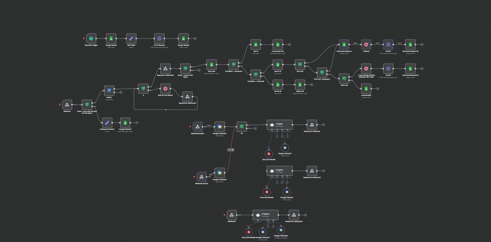
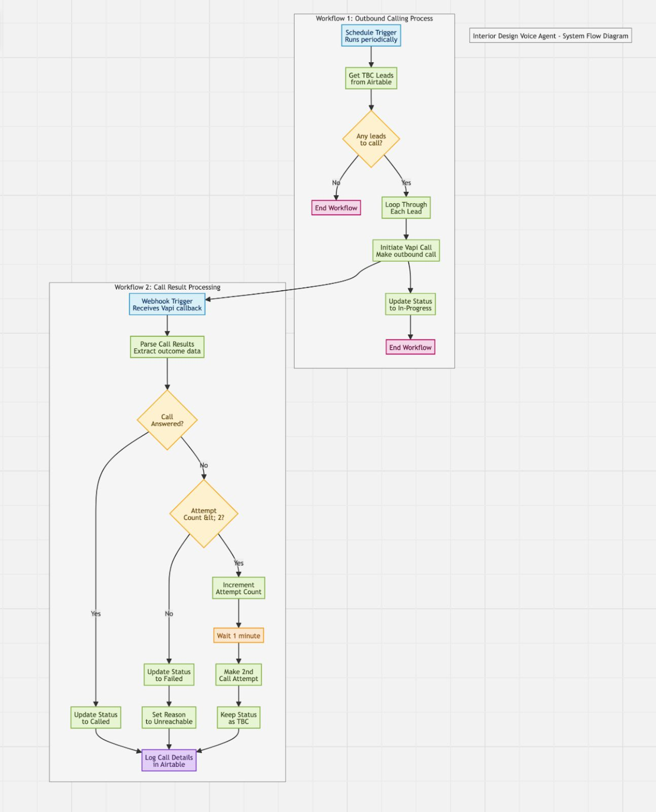
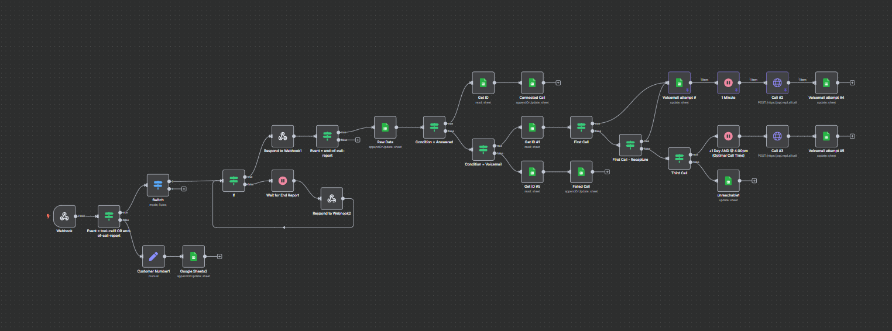
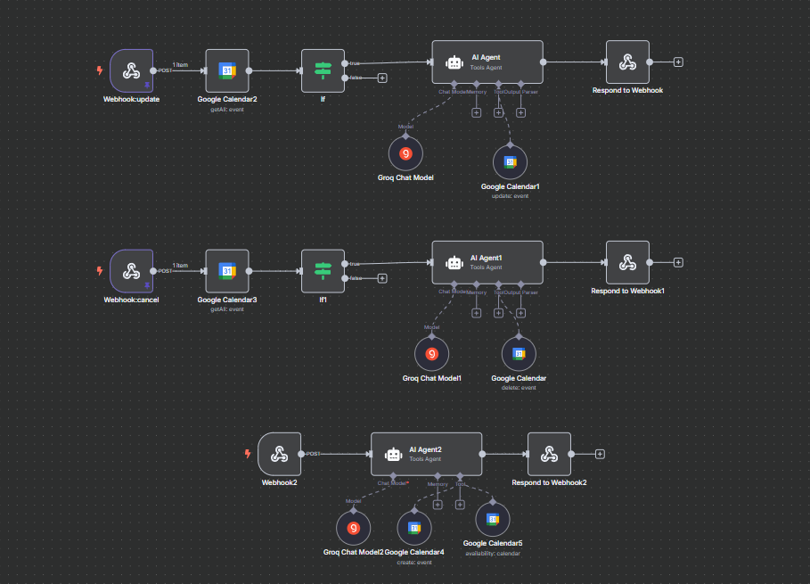

# 🤖 Autocall-Lead-Orchestrator

An intelligent outbound call automation and appointment booking pipeline that qualifies leads, schedules appointments, and syncs data with your CRM — all without lifting a finger.

### Watch the Demo
Check out the demo video to see the workflow in action:

[Watch the Video](https://www.youtube.com/watch?v=PefjZTLerwc)

---

---

## 🚀 Overview

**AutoCall Lead Qualifier** is a pre-built n8n workflow designed for businesses to automate customer outreach, qualify leads through intelligent voice agents, and streamline appointment scheduling. It’s fully customizable, fast to deploy, and integrates seamlessly with your CRM and Google Calendar.

---

## 🔑 Key Features

- 📞 **Outbound Voice Calls** — Initiates automated calls to website/form leads  
- 🧠 **Lead Qualification** — Intelligent voice agent filters leads based on your business rules  
- 📅 **Appointment Booking** — Books confirmed leads into your calendar  
- 🗂️ **CRM Integration** — Automatically stores lead details in Google Sheets or any connected CRM  
- ⏰ **Call Scheduling Logic** — Avoids duplicate calls, supports follow-ups and time window logic

---

## ⚙️ Tech Stack

- [n8n](https://n8n.io/) – Automation workflow engine  
- [Vapi](https://www.vapi.ai/) – Voice agent platform  
- [Groq + Llama 4](https://groq.com/) – Ultra-fast LLM inference  
- Google Sheets & Google Calendar – CRM storage and appointment slots  
- Optional extensions – Slack, Notion, Email alerts, and more

---

## 🛠️ Installation & Setup

1. **Download the JSON workflow file** → [`lead_qualifier_workflow.json`](./Autocall_Lead_Orchestrator.json)  
2. **Import into n8n** via the workflow import option  
3. **Set Credentials**  
   - Vapi API Key (Voice Agent)  
   - Google Account (Sheets + Calendar)  
4. **Customize** the voice agent and qualifying questions (via Vapi)  
5. ✅ You’re ready to go!

> 💡 _No coding required — just drag, drop, and deploy!_

---

## Workflow

---

---

## 🧩 Use Cases

- Interior Design Firms qualifying renovation leads
- Real Estate Agents scheduling house visits
- Clinics confirming appointments with patients
- EdTechs screening course inquiries

---

## 📈 Future Enhancements

- 🌐 Multilingual voice support  
- 📊 Analytics dashboard for call outcomes  
- 💬 WhatsApp fallback for unreachable leads  
- 🔀 Multi-agent orchestration logic

---

## 🤝 Contributing

Pull requests and feedback are welcome! For major changes, please open an issue first to discuss what you’d like to change.

---

## 📩 Contact

For questions, customization requests, or collaborations, feel free to reach out:  
📧 [Email](mailto:erkrishbhimani@gmail.com)

---

